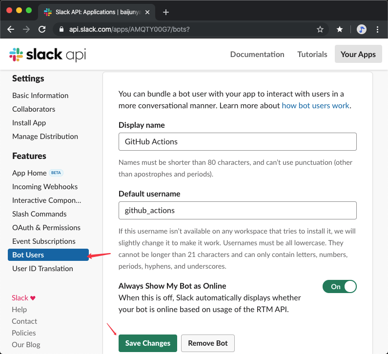
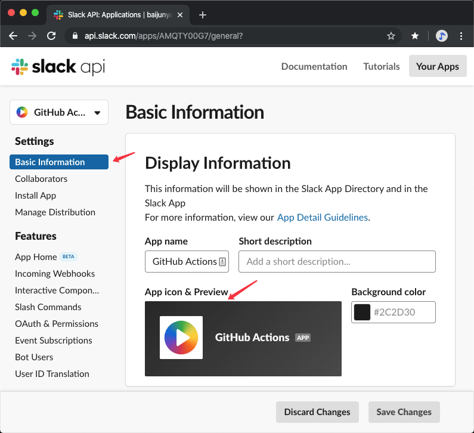
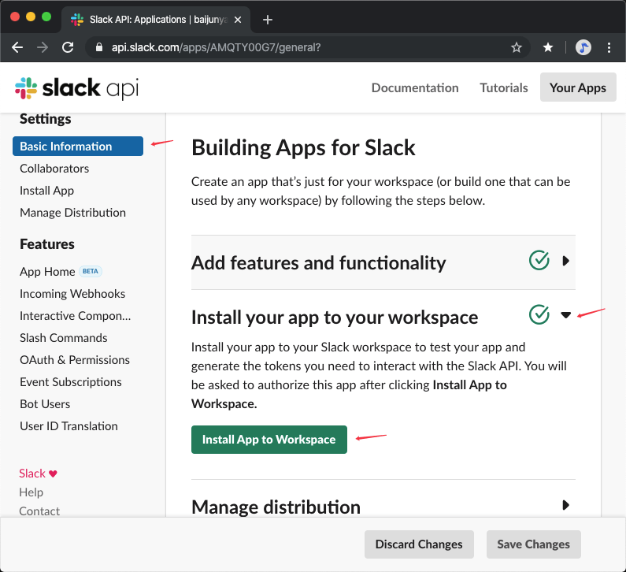
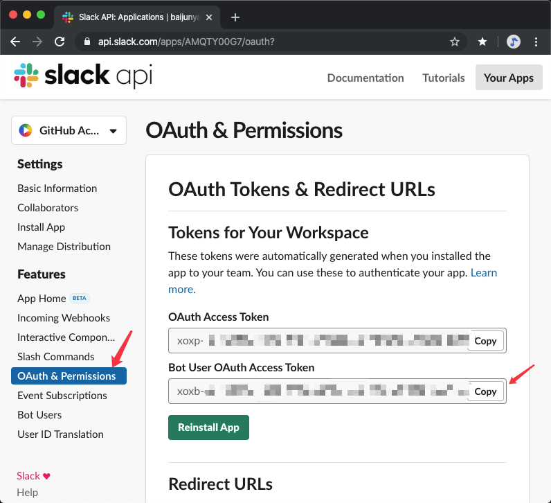
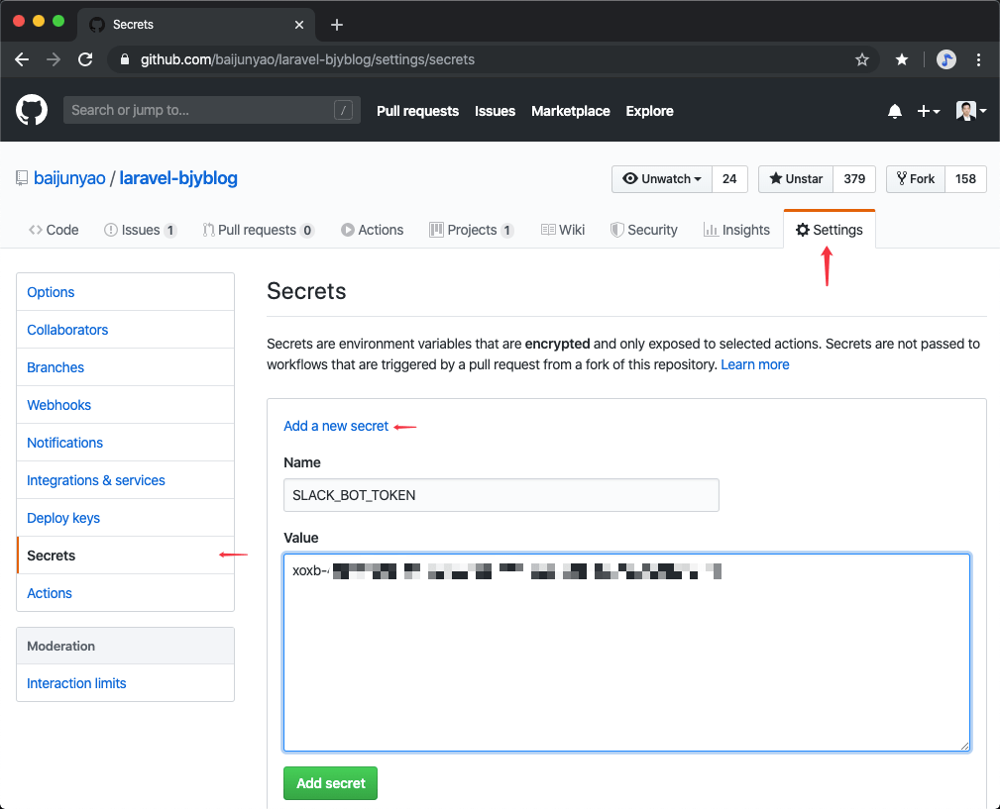

## Usage
```yaml
- name: Notify slack
  uses: baijunyao/action-slack-notify@master
  if: always()
  with:
    channel: GN87KBVDG
    slack_bot_token: ${{ secrets.SLACK_BOT_TOKEN }}
    github_context: ${{ toJson(github) }}
    job_context: ${{ toJson(job) }}
```

## Setup
1. [Creating a Slack App](https://api.slack.com/apps)  
  
2. Add a Bot user  
 
3. Set an icon for your bot  [Download icon](https://github.com/baijunyao/action-slack-notify/raw/master/docs/app-icons/github-action-icon.png)
  
4. Install your app to your workspace

5. Copy the "Bot User OAuth Access Token"  

6. Add the "Bot User OAuth Access Token" to GitHub secret


## Example
- [laravel-bjyblog](https://github.com/baijunyao/laravel-bjyblog/blob/master/.github/workflows/push.yml)

## Thanks
- [pullreminders/slack-action](https://github.com/pullreminders/slack-action)
